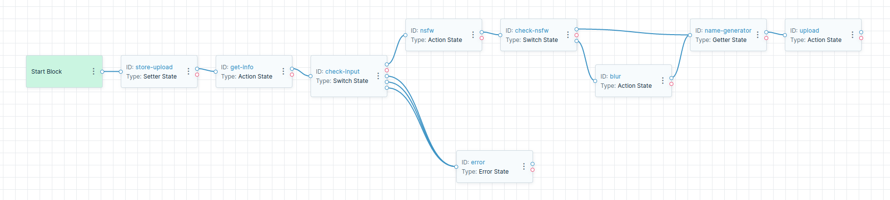

# NSFW Image Example

### Used Functions

- [image-magick](https://apps.direktiv.io/search-results/image-magick?v=1.0)
- [nsfw](https://apps.direktiv.io/search-results/nsfw?v=1.0)
- [aws-cli](https://apps.direktiv.io/search-results/aws-cli?v=1.0)

### Example Images

All images used for testing are in the `images` folder. The test images are causing different behaviours within the workflow.

- [sfw.png](images/sfw.png): Safe-for-work image
- [nsfw.png](images/nsfw.png): Not-Safe-For-Work image
- [nopng.jpeg](images/nopng.jpeg): JPG file, which will be rejected
- [nopng.gif](images/nopng.gif): GIF file, which will be rejected
- [toobig.png](images/toobig.png): Too large image, rejected for dimensions
- [overlay.png](images/overlay.png): Additional text at the end of the image, e.g. PHP overlay example

The workflow is assuming the image is getting posted directly as binary to the workflow via Direktiv's API. In the Enterprise Edition it would be an additional route on the API gateway but in this example we are assuming the Open-Source version is being used. 

*Example CURL command*
```sh
curl -vvv --data-binary @images/sfw.png http://MYSERVER/api/namespaces/MYNAMESPACE/tree/upload?op=wait
```

### Workflow



### States

#### State 1: store-upload

Direktiv accepts JSON as payload for workflows. If the payload is not JSON it converts it to a base64 input and uses this a s the payload for the workflow, e.g.

```json
{
    "input": "S0MeBaSe64CoNtEnT=="
}
```

In the first state the workflow stores the input base64 data as instance variable with the name `image`.

#### State 2: get-info

The second state uses image-magick to execute two commands. The fist command `convert -strip image out/instance/converted` uses the stored `image` file and strips away unnecessary data from the file, e.g. extif over malicious overlay data. The second command `convert out/instance/converted json:` returns image information in JSON format. This command would fail if the upload content is not an image at all. The `transformation` part extracts the format and the width and height of the image. The new version of the image is stored in an instance variable `converted`.

#### State 3: check-input

This state checks for width and height requirements as well as format. In this case the upload accepts PNG only. If on of the conditions is true the workflow transitions to an error state with an error message explaining the problem. 

#### State 4: nsfw

The nsfw check uses the image `converted` for assessment. The NSFW container checks for multiple attributes, e.g. neutral, hentai, sexy etc. 

#### State 5: check-nsfw

This `switch` state only checks for the attribubte `neutral` of the nsfw check. The threshold is `0.8`. The switch transitions to the next state (`name-generator`) if the threshold is above and to a `blur` state if the threshold is not met. 

#### State 6: blur

This state is only executed if the threshold was not met in the `check-nsfw` switch. It uses image magick to blur the image. It overwrites the `converted` image with using `out/instance/converted` in the output of the command.

#### State 7: name-generator

This state is a helper state. The files are uploaded in the following state but require a unique name. The getter state has a `system` scope where this state fetches the unique instyance id used as a name for the upload.

#### State 8: upload

Using the AWS cli container the file `converted` is getting upload to Linode's S3 with the instance id as name. 

